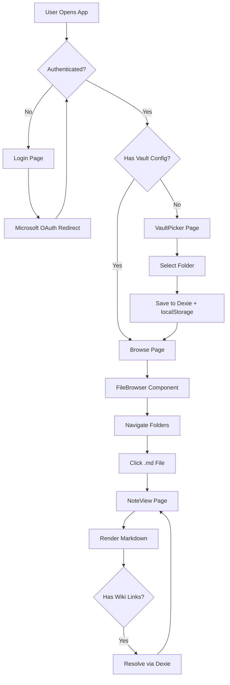
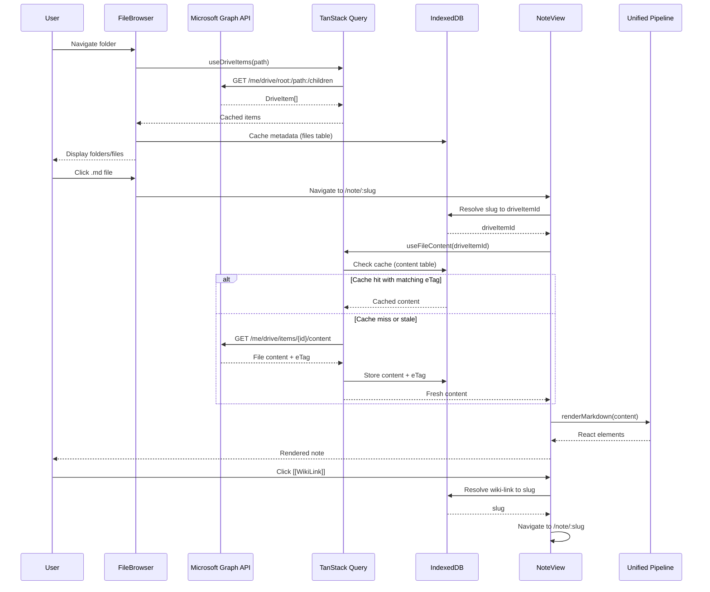

# Agent Guide for OneDrive Markdown Viewer

## Project Overview
PWA for viewing Obsidian markdown files stored in OneDrive. Must work on iOS. Users authenticate with Microsoft, select a vault folder, browse files, and read notes with full offline support for previously viewed content.

## Commands
- `pnpm dev` - Start development server
- `pnpm build` - Build for production (runs TypeScript check + Vite build)
- `pnpm lint` - Run ESLint
- `pnpm preview` - Preview production build

## Tech Stack

### Core Framework
- **React 19** + **TypeScript** + **Vite 7**
- **React Router 7** (HashRouter for iOS PWA compatibility)
- **TanStack Query 5** (data fetching, caching, retries)

### UI & Styling
- **shadcn/ui** components (Radix UI primitives)
- **Tailwind CSS 4** (via @tailwindcss/vite plugin)
- **@tailwindcss/typography** (prose styling for markdown)

### Authentication
- **@azure/msal-browser** + **@azure/msal-react**
- Redirect flow (required for iOS PWA)
- Authority: `https://login.microsoftonline.com/consumers` (Personal accounts only)
- Scopes: `Files.Read`, `offline_access`
- Token storage: `localStorage` (survives PWA restarts)

### API & Storage
- **@microsoft/microsoft-graph-client** (OneDrive API)
- **Dexie 4** (IndexedDB wrapper for offline storage)
- **localStorage** (vault config fallback)

### Markdown Processing
- **unified** + **remark** + **rehype** pipeline
- **remark-parse**, **remark-gfm**, **remark-frontmatter**, **remark-math**, **remark-wiki-link**
- **remark-rehype** (bridge to HTML)
- **rehype-slug** (heading anchors), **rehype-katex** (math), **rehype-highlight** (code), **rehype-sanitize** (XSS protection)
- **rehype-react** (render to React elements)
- **js-yaml** (frontmatter parsing)
- **katex** (math rendering)

### PWA
- **vite-plugin-pwa** + **Workbox**
- Service worker with NetworkFirst strategy for Graph API
- App shell caching
- Manifest with icons (192x192, 512x512)

### Build Tools
- **React Compiler** (babel-plugin-react-compiler)
- **TypeScript ESLint** (type-aware linting)
- **Vite** (bundling, HMR)

## Project Structure

```
src/
├── auth/
│   ├── msalConfig.ts       # MSAL configuration (authority, scopes, cache)
│   └── useAuth.tsx         # Login/logout hooks
├── graph/
│   ├── client.ts           # Graph API client factory + helpers
│   └── hooks.ts            # TanStack Query hooks (useDriveItems, useFileContent)
├── offline/
│   ├── db.ts               # Dexie schema (VaultFile, FileContent, Attachment, etc.)
│   ├── vaultConfig.ts      # Vault selection persistence (Dexie + localStorage)
│   └── content.ts          # Content fetching with eTag caching
├── markdown/
│   ├── index.ts            # Unified markdown pipeline
│   ├── linkResolver.ts     # Wiki-link resolution ([[Note]], [[Note#Heading]])
│   ├── imageResolver.ts    # Relative image path resolution
│   └── rehype-trim-code.ts # Custom rehype plugin
├── pages/
│   ├── Login.tsx           # Sign-in screen
│   ├── VaultPicker.tsx    # Folder picker for vault selection
│   ├── Browse.tsx          # Vault check + FileBrowser wrapper
│   ├── FileBrowser.tsx    # Folder/file navigation with filtering
│   ├── NoteView.tsx        # Markdown renderer with raw/render toggle
│   └── Settings.tsx        # Vault config, cache clear, logout
├── components/
│   └── ui/                 # shadcn/ui components (button, card, input, etc.)
├── lib/
│   └── utils.ts           # Utility functions (cn for className merging)
├── App.tsx                 # Root component (MSAL + Query + Router setup)
└── main.tsx                # Entry point
```

## Architecture Overview

### Application Flow



### Data Flow



### Authentication Architecture

- **MSAL Configuration** (`src/auth/msalConfig.ts`):
  - Authority: `https://login.microsoftonline.com/consumers` (Personal accounts)
  - Redirect URI: `window.location.origin` (works for iOS PWA)
  - Cache location: `localStorage` (survives app restarts)
  - Scopes: `Files.Read`, `offline_access`
  - Logger filters PII (no token logging)

- **Token Acquisition** (`src/graph/client.ts`):
  - Primary: `acquireTokenSilent()` (no user interaction)
  - Fallback: `loginRedirect()` on `InteractionRequiredAuthError`
  - Token passed to Graph client via `authProvider` callback

- **Auth Hook** (`src/auth/useAuth.tsx`):
  - `login()`: Triggers redirect flow
  - `logout()`: Clears session via `logoutRedirect`
  - `isAuthenticated`: Checks `accounts.length > 0`

### Routing Architecture

Routes defined in `src/App.tsx` using `HashRouter` (iOS-safe):

- `/` → Redirects to `/browse` when authenticated
- `/vault-picker` → Folder picker for vault selection
- `/browse` → File browser (checks vault config first)
- `/note/:id` → Note viewer (slug-based routing)
- `/settings` → Settings page (vault config, cache, logout)

All routes wrapped in `AuthenticatedTemplate` / `UnauthenticatedTemplate` from MSAL.

### Data Storage Architecture

**Dexie Schema** (`src/offline/db.ts`):

- **VaultConfig**: Single record (`id: 'current'`)
  - `vaultPath`, `vaultName`, `driveItemId`, `selectedAt`
- **VaultFile**: File metadata (indexed by `id`, `driveItemId`, `path`, `name`, `parentPath`)
  - `id`, `driveItemId`, `path`, `name`, `eTag`, `lastModified`, `size`, `parentPath`, `aliases[]`
- **FileContent**: Note content (indexed by `id`, `driveItemId`, `eTag`)
  - `id`, `driveItemId`, `content`, `eTag`, `lastSynced`
- **Attachment**: Image blobs (indexed by `id`, `driveItemId`)
  - `id`, `driveItemId`, `blob`, `mimeType`, `size`, `lastSynced`
- **SyncState**: Delta sync state (placeholder, not yet implemented)
- **PendingOperation**: Reserved for future write operations

**Persistence Strategy**:
- Primary: Dexie (IndexedDB) - survives app restarts
- Fallback: localStorage for vault config (quick check via `hasVaultConfig()`)
- Both updated simultaneously for vault config

### Markdown Pipeline Architecture

**Pipeline** (`src/markdown/index.ts`):

1. **Parse**: `remark-parse` (markdown → AST)
2. **Transform**:
   - `remark-frontmatter` (extract YAML frontmatter)
   - `remark-gfm` (GitHub Flavored Markdown: tables, strikethrough, etc.)
   - `remark-math` (math syntax)
   - `remark-wiki-link` (Obsidian `[[Note]]` links)
     - `pageResolver`: Converts link name to slug
     - `hrefTemplate`: Generates `#/note/:slug#anchor` URLs
3. **Convert**: `remark-rehype` (AST → HTML AST)
4. **Transform HTML**:
   - `rehype-slug` (heading IDs for anchors)
   - `rehype-katex` (math rendering)
   - `rehype-trim-code` (custom: trim empty lines in code blocks)
   - `rehype-highlight` (syntax highlighting)
   - `rehype-sanitize` (XSS protection, allows KaTeX elements)
5. **Render**: `rehype-react` (HTML AST → React elements)

**Link Resolution** (`src/markdown/linkResolver.ts`):
- `resolveWikiLink()`: Case-insensitive filename matching, supports aliases
- `resolveSlugToItemId()`: Maps URL slug → driveItemId via Dexie
- `createSlugFromFilename()`: Normalizes filename to URL-safe slug

**Image Resolution** (`src/markdown/imageResolver.ts`):
- `resolveImagePath()`: Resolves relative paths (`./img.png`, `../folder/img.png`, `/absolute/path.png`)
- Caches images in Dexie `attachments` table as Blobs
- Returns blob URLs for rendering

### PWA Configuration

**Service Worker** (`vite.config.ts`):
- `registerType: 'autoUpdate'` (updates automatically)
- `navigateFallback: 'index.html'` (SPA routing)
- **Runtime Caching**:
  - Graph API: `NetworkFirst` strategy (10s timeout)
  - Cache name: `graph-api-cache`
  - Cacheable responses: `[0, 200]` (handles opaque responses)

**Manifest**:
- Name: "OneDrive Markdown Viewer"
- Short name: "MD Viewer"
- Display: `standalone`
- Orientation: `portrait`
- Icons: 192x192, 512x512 (maskable)

## Current Capabilities

### Implemented (Phase 0-2)

✅ **Authentication**:
- Microsoft OAuth redirect flow
- Token persistence in localStorage
- Silent token refresh
- Logout functionality

✅ **Vault Selection**:
- Browse OneDrive folders from root
- Select vault folder
- Persist selection (Dexie + localStorage)
- Change vault from settings

✅ **File Browsing**:
- Navigate folders within vault root
- Folder-first sorting (folders before files)
- Markdown-first sorting (`.md` files before other files)
- Filename filtering (client-side)
- Metadata caching to Dexie
- Pagination support (infinite scroll)
- Visual indicators (folders, markdown files, other files)

✅ **Note Viewing**:
- Render markdown with full Obsidian support:
  - GFM (tables, strikethrough, task lists)
  - Frontmatter (read-only, extracts `source` URL)
  - Math (KaTeX)
  - Wiki-links (`[[Note]]`, `[[Note#Heading]]`)
  - Code blocks with syntax highlighting
  - Images (relative paths resolved)
- Content caching with eTag validation
- Raw/render toggle
- Hash anchor scrolling (`#/note/slug#heading-id`)
- Offline support (previously viewed notes)

✅ **Link Navigation**:
- Internal wiki-links navigate within app
- Section links scroll to headings
- Case-insensitive filename matching
- Alias support (from frontmatter, when available)

✅ **Offline Support**:
- App shell cached via Workbox
- File metadata cached in Dexie
- Note content cached with eTag
- Image attachments cached as Blobs
- Previously viewed notes work offline

## Known Limitations & Gaps

### Not Yet Implemented

❌ **Delta Sync** (Phase 3):
- No automatic sync on app start/focus
- No delta API integration (`/me/drive/root:/path:/delta`)
- `SyncState` table exists but unused
- No sync status indicators
- No last sync timestamp display

❌ **Image Integration**:
- Image resolver implemented but not fully integrated into markdown renderer
- Images must be accessed once while online to cache
- No automatic image fetching from markdown AST

❌ **Advanced Features** (Post-MVP):
- Full-text search across vault
- Backlinks and graph view
- Note embeds (`![[Note]]`)
- Callouts rendering
- Footnotes
- Mermaid diagrams
- Task list interactions

❌ **Multi-Account**:
- Single Microsoft account only
- No OneDrive for Business support
- No account switching

❌ **Editing**:
- Read-only viewer (no editing capabilities)
- No `Files.ReadWrite` scope

❌ **Performance Optimizations**:
- No virtualized lists for large folders
- No concurrency limits for API calls
- No request batching

## iOS PWA Requirements

- ✅ Redirect flow (not popup) for authentication
- ✅ Tokens in localStorage (survives PWA restarts)
- ✅ HashRouter (works with iOS Safari)
- ✅ IndexedDB for offline files
- ✅ Cache API for app shell only
- ⚠️ No background sync (sync on app start/focus - not yet implemented)
- ⚠️ No install prompt (users must manually "Add to Home Screen")

## Environment Variables

Create `.env` file from `.env.example`:
- `VITE_MSAL_CLIENT_ID` - Azure AD app client ID from https://portal.azure.com

Required at build time (embedded in bundle).

## Azure AD App Setup

1. Register app at https://portal.azure.com/#blade/Microsoft_AAD_RegisteredApps
2. Set redirect URI to your app URL (e.g., `http://localhost:5173` for dev)
3. Enable "Files.Read" and "offline_access" scopes
4. Use "Personal Microsoft accounts" for OneDrive personal
5. Copy Client ID to `.env` as `VITE_MSAL_CLIENT_ID`

## Code Conventions

- Use shadcn/ui components for UI consistency
- Functional components with hooks (no class components)
- TanStack Query for all data fetching (automatic caching, retries)
- Proper TypeScript types (avoid `any`, use `unknown` for error handling)
- React Compiler enabled (automatic memoization)
- Tailwind CSS for styling (utility-first)
- File naming: kebab-case for multi-word files

## Development Workflow

1. **Setup**:
   ```bash
   pnpm install
   cp .env.example .env
   # Add VITE_MSAL_CLIENT_ID to .env
   ```

2. **Development**:
   ```bash
   pnpm dev
   # App runs on http://localhost:5173
   ```

3. **Build**:
   ```bash
   pnpm build
   # Output: dist/ (main.js, index.html, assets, service worker)
   ```

4. **Preview**:
   ```bash
   pnpm preview
   # Test production build locally
   ```

## Testing Checklist

### Authentication
- [ ] Sign in with Microsoft account
- [ ] Token persists after app restart
- [ ] Logout clears session
- [ ] Re-authentication on token expiry

### Vault Selection
- [ ] Browse folders from OneDrive root
- [ ] Select vault folder
- [ ] Vault persists after app restart
- [ ] Change vault from settings

### File Browsing
- [ ] Navigate folders within vault
- [ ] Folders appear before files
- [ ] Markdown files appear before other files
- [ ] Filename filter works
- [ ] Cannot navigate above vault root
- [ ] Pagination loads more items

### Note Viewing
- [ ] Open markdown file from browser
- [ ] Markdown renders correctly (GFM, math, code blocks)
- [ ] Wiki-links navigate to other notes
- [ ] Section links scroll to headings
- [ ] Images load and display
- [ ] Raw/render toggle works
- [ ] Frontmatter `source` link appears

### Offline Support
- [ ] View previously opened notes offline
- [ ] Cached images display offline
- [ ] App shell loads offline
- [ ] File browser shows cached metadata offline

## Next Steps (Future Phases)

### Phase 3: Delta Sync
- Implement OneDrive delta API integration
- Add sync triggers (app start, focus, manual refresh)
- Handle file updates, deletes, renames
- Add sync status indicators
- Implement throttling and 429/503 handling

### Phase 4: UX Polish
- Add install guidance (A2HS tip)
- Offline/online banners
- Pull-to-refresh in viewer
- Settings: storage usage, clear cache, theme toggle
- Performance tuning (concurrency limits, memoization)
- Accessibility pass

### Post-MVP
- Full-text search
- Backlinks and graph view
- Note embeds (`![[Note]]`)
- Callouts, footnotes, Mermaid
- Multi-account support
- Editing capabilities (`Files.ReadWrite`)
