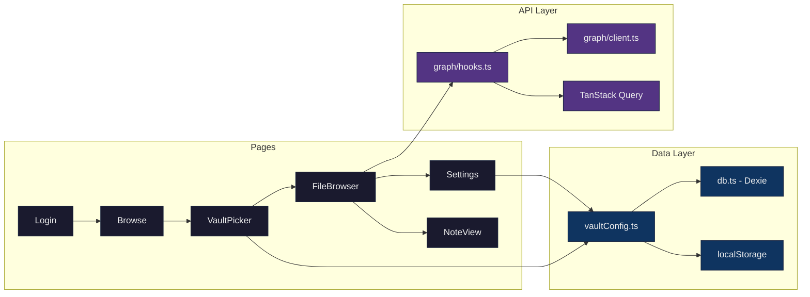
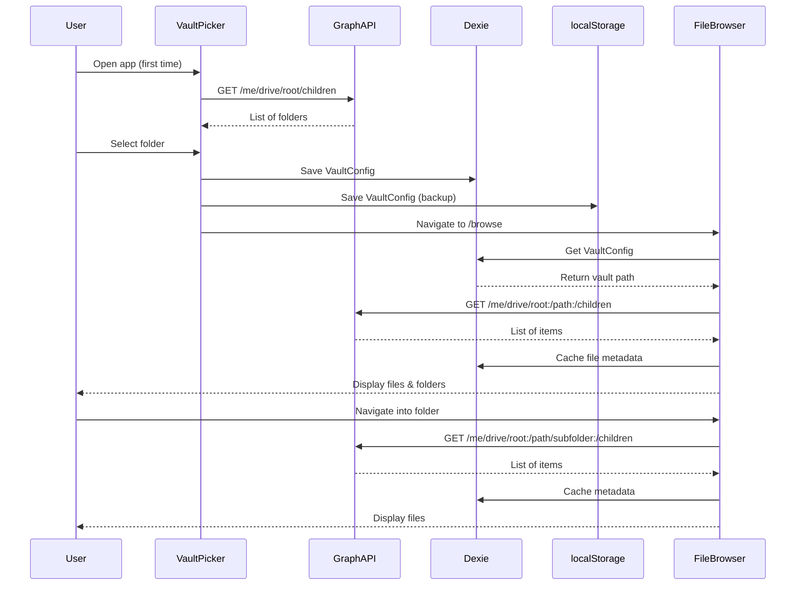
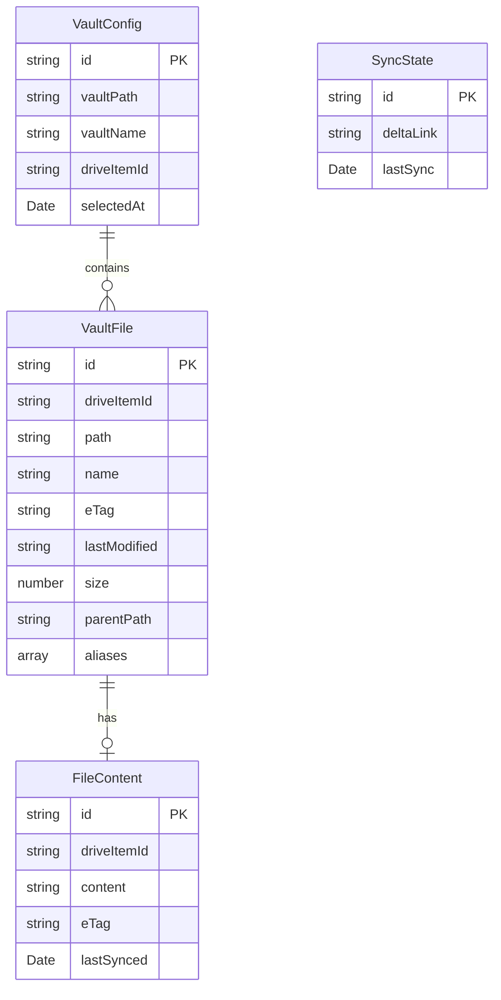

# Phase 1 Architecture Diagram

## User Flow & Data Architecture

```mermaid
graph TB
    subgraph "User Flow"
        A[User Opens App] --> B{Authenticated?}
        B -->|No| C[Login Page]
        C --> D[Microsoft OAuth]
        D --> E{Has Vault?}
        B -->|Yes| E
        E -->|No| F[VaultPicker]
        F --> G[Browse OneDrive Folders]
        G --> H[Select Vault Root]
        H --> I[FileBrowser]
        E -->|Yes| I
        I --> J[Navigate Folders]
        J --> K[View Files]
        K --> L[Click .md File]
        L --> M[NoteView - Phase 2]
    end
    
    subgraph "Data Storage"
        N[(Dexie IndexedDB)]
        O[localStorage]
        P[VaultConfig Table]
        Q[Files Table]
    end
    
    subgraph "API Layer"
        R[Microsoft Graph API]
        S[/me/drive/root/children]
        T[TanStack Query Cache]
    end
    
    H --> N
    H --> O
    N --> P
    I --> R
    R --> S
    S --> T
    T --> I
    I --> N
    N --> Q
    
    classDef primary fill:#1a1a2e,stroke:#16213e,color:#eee
    classDef storage fill:#0f3460,stroke:#16213e,color:#eee
    classDef api fill:#533483,stroke:#16213e,color:#eee
    
    class A,B,C,D,E,F,G,H,I,J,K,L,M primary
    class N,O,P,Q storage
    class R,S,T api
```

## Component Structure



## Data Flow Sequence



## Database Schema



## Key Design Decisions

### 1. Dual Persistence Strategy
- **Dexie (IndexedDB)**: Primary storage for all data
- **localStorage**: Backup for quick vault config checks
- Ensures vault selection survives PWA restarts on iOS

### 2. Folder-First Sorting
FileBrowser sorts items as:
1. Folders (alphabetically)
2. Markdown files (alphabetically)
3. Other files (alphabetically)

### 3. Progressive Caching
- Metadata cached on-demand as user browses
- No bulk download on initial sync (deferred to Phase 3)
- Optimizes for fast initial load

### 4. Vault Root Boundary
- Users cannot navigate above selected vault root
- Prevents confusion and maintains vault isolation
- "Back" button disabled at vault root

### 5. TanStack Query Integration
- Built-in retry logic with smart backoff
- Automatic caching of API responses
- Error handling for 401/404 status codes
